# Web Mapping (Part 1) — HAR → GeoJSON → Web Map

Below are four websites I profiled. For each: a link, a one-line description, and a 3-image layout (large map + two supporting images).

---

## National Geographic
**Link:** https://www.nationalgeographic.com/  
**About:** Global magazine/site focused on science, exploration, nature, and culture.

<table>
  <tr>
    <td style="vertical-align:top; width:50%;">
  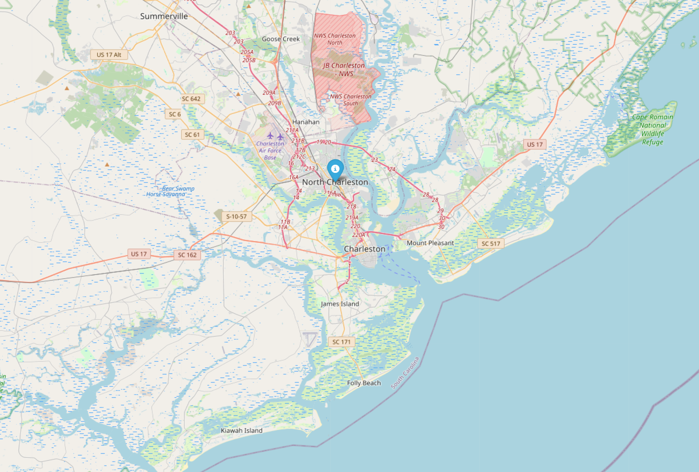
    </td>
    <td style="vertical-align:top; width:50%;">
  
    </td>
  </tr>
  <tr>
    <td style="vertical-align:top; width:50%;">
  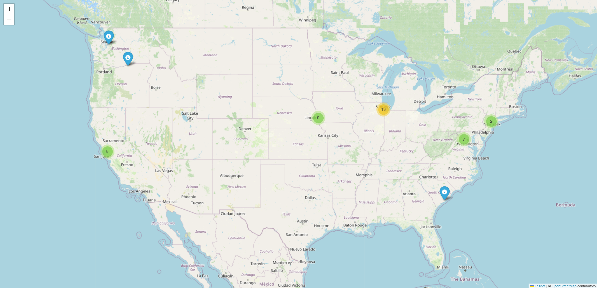
    </td>
    <td style="vertical-align:top; width:50%;">
  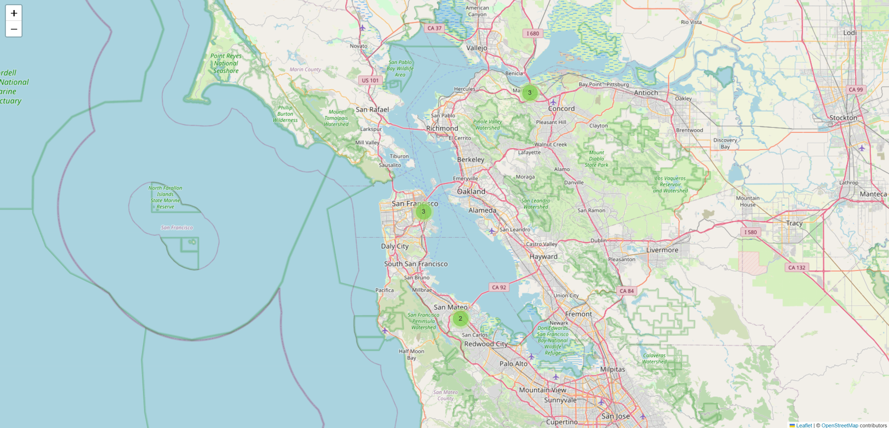
    </td>
  </tr>
  <tr>
    <td style="vertical-align:top; width:50%;">
  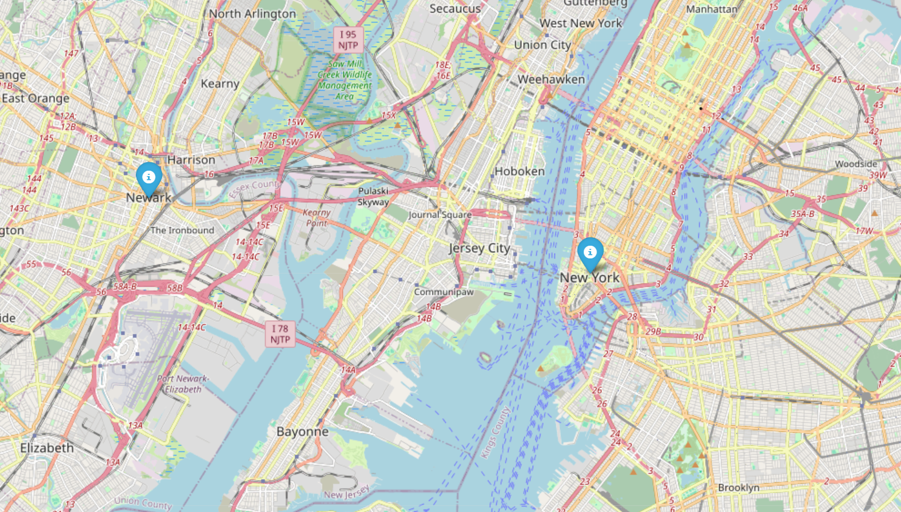
    </td>
    <td style="vertical-align:top; width:50%;">
  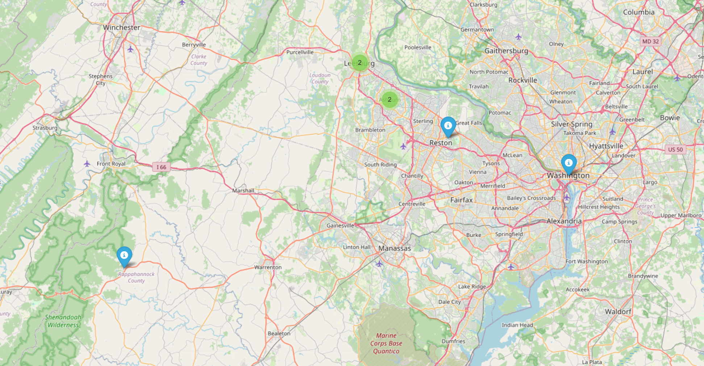
    </td>
  </tr>
  <tr>
    <td style="vertical-align:top; width:50%;">
  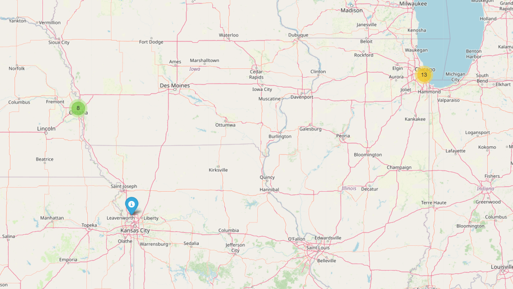
    </td>
    <td style="vertical-align:top; width:50%;">
  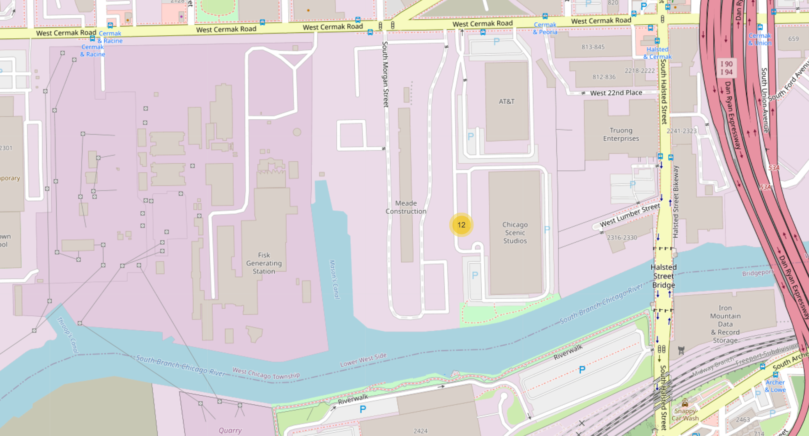
    </td>
  </tr>
  <tr>
    <td style="vertical-align:top; width:50%;">
      
    </td>
    <td style="vertical-align:top; width:50%;">
      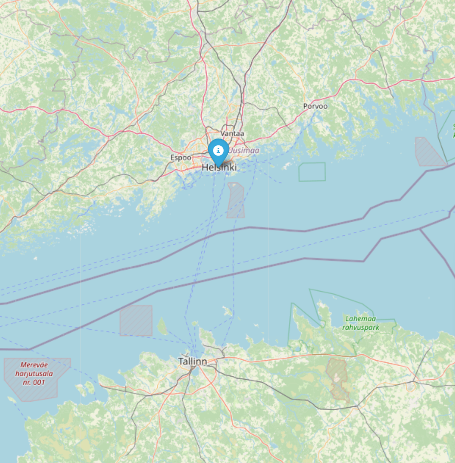
    </td>
  </tr>
</table>

---

## TLG GROUP
**Link:** https://tlg.co.jp/ 
**About:** Japanese company that operates finance media (FX/crypto), publishes expert interviews, and hosts financial education seminars.

<table>
  <tr>
    <td style="vertical-align:top; width:66%;">
  
    </td>
    <td style="vertical-align:top; width:34%;">
   
  
    </td>
  </tr>
</table>

---

## Bhutan Immigration
**Link:** https://immi.gov.bt  
**About:** Official portal of Bhutan's Department of Immigration for visas and immigration services.

<table>
  <tr>
    <td style="vertical-align:top; width:50%;">
      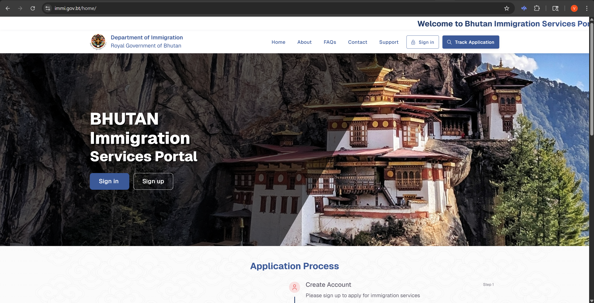
    </td>
    <td style="vertical-align:top; width:50%;">
      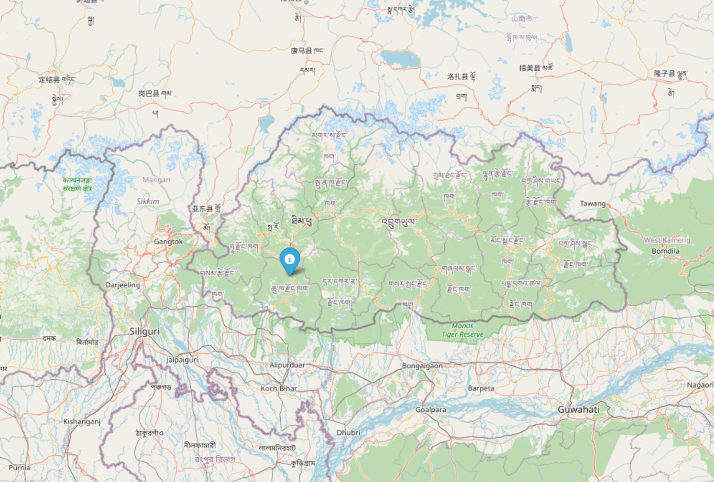
    </td>
  </tr>
  <tr>
    <td style="vertical-align:top; width:50%;">
      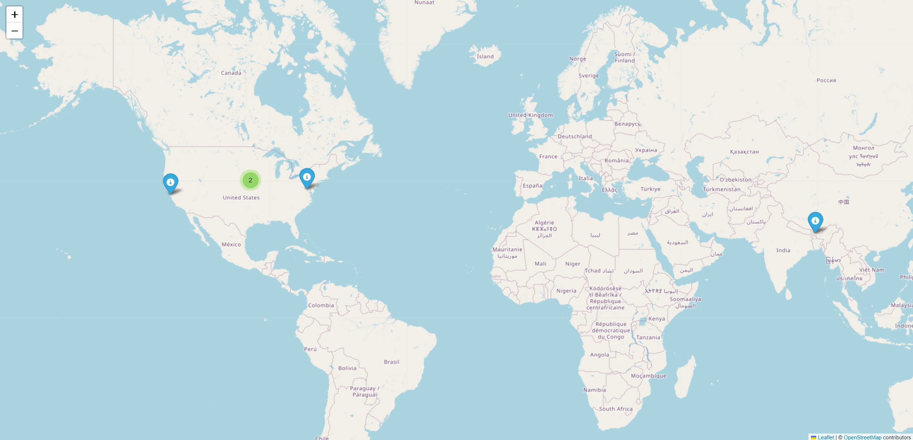
    </td>
    <td style="vertical-align:top; width:50%;">
      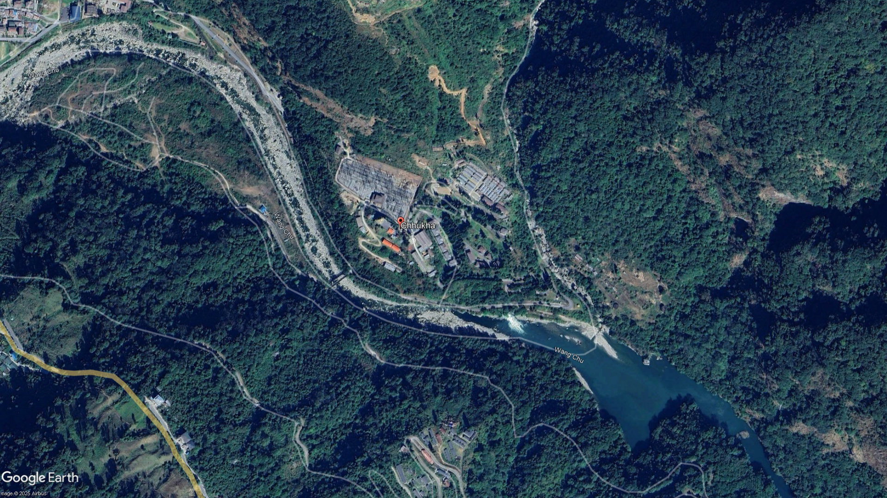
    </td>
  </tr>
</table>

---

## iGOD (Integrated Government Online Directory)
**Link:** https://igod.gov.in/  
**About:** Directory of Indian government websites/organizations maintained by the National Informatics Centre.

<table>
  <tr>
    <td style="vertical-align:top; width:66%;">
  
    </td>
    <td style="vertical-align:top; width:34%;">
   
  
    </td>
  </tr>
</table>

